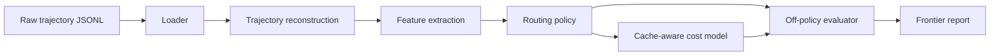

# Router Architecture

This repository is currently empty, so this file defines the architecture I would use for the model router described in the deck.

## What the router has to do

The deck implies an offline, cache-aware routing system with three hard constraints:

1. Each call must choose a model from the supported model set.
2. Cost must be estimated with cache effects, not just naive token counts.
3. Evaluation must be off-policy, because the logs only contain the model that actually ran.

## High-level flow



## Components

### 1. Data loader

Reads the exported JSONL files and normalizes them into typed trajectory objects.

Responsibilities:

- parse each line of the offline export
- validate `model`, `input`, and `tools`
- preserve ordering and call history
- split the export into train / validation / held-out partitions

### 2. Trajectory reconstruction

Groups calls that belong to the same task by using the opening messages and shared history.

Responsibilities:

- reconstruct full task trajectories from per-call records
- identify the call index within the trajectory
- expose prior-call context for each step

### 3. Feature extraction

Builds the state representation the router sees.

Useful features from the deck:

- prompt length
- call position in the trajectory
- tool count and tool types
- presence of function-call chains
- cacheable shared prefix length
- prior model choices in the same trajectory

### 4. Routing policy

Chooses the model for each call.

Start with two policy families:

- heuristic router: quick baseline using call position and prompt length
- learned router: classifier or ranker trained on reconstructed trajectories

Policy interface:

- input: call context
- output: model id

### 5. Cost model

Computes cache-aware cost.

Responsibilities:

- estimate token counts when `usage` is absent
- price cached and uncached prefix tokens differently
- reset cache state when the model changes
- return cost in tokens or dollars

### 6. Outcome signal

Because the dataset does not ship a direct quality label, the system needs a proxy.

Possible signals:

- judge-model score on final outputs
- task completion inferred from the final message
- function-call error patterns

### 7. Off-policy evaluator

Measures what would have happened if the router had changed the model selection.

Responsibilities:

- compare trajectories across model families
- support matching or importance weighting
- compute the cost-quality frontier
- report confidence / failure modes

### 8. Reporting

Produces the final submission artifacts:

- one router
- one defensible evaluation
- one slide or chart showing the frontier

## Suggested repo layout

```text
router/
  __init__.py
  types.py
  loader.py
  reconstruction.py
  features.py
  policy.py
  costs.py
  evaluator.py
  report.py
scripts/
  load_trajectories.py
  baseline_router.py
docs/
  router_architecture.md
```

## Practical build order

1. Implement the loader and typed trajectory objects.
2. Reconstruct trajectories and verify grouping.
3. Add the cache-aware cost model.
4. Ship a heuristic router baseline.
5. Add a learned router.
6. Add off-policy evaluation and frontier reporting.

## Deck-aligned interpretation

The deck’s central idea is that router quality is not only “which model should answer this call,” but also “what does a model switch do to the shared cache.” That means the architecture should treat routing and pricing as one system, not two separate utilities.
